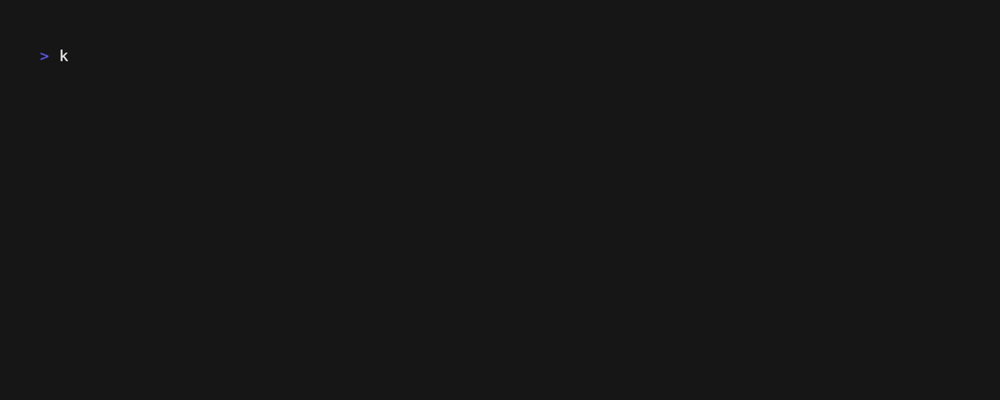

# Kubesafe

---

**Kubesafe** 🔁 Tired of accidentally running dangerous commands on the wrong Kubernetes cluster? Meet kubesafe — your new best friend for safely managing multiple Kubernetes contexts!

<p>
    <a href="https://github.com/Telemaco019/kubesafe/actions"></a>
</p>

---



**kubesafe** allows you to safely run commands acrosss multiple Kubernetes contexts.
By allowing you to mark specific contexts as "safe" and define a list of protected commands, kubesafe makes sure
you never accidentally run a dangerous command on the wrong cluster.

Key Features:

- **🚀 Works with any Kubernetes tool**: kubesafe can wraps any CLI that targets a Kubernetes cluster. Whether you're using kubectl, helm, or any other tool, kubesafe has you covered.
- **🛡️ Context Protection with Custom Commands**: Mark one or more contexts as "safe" and define a list of commands that require confirmation before execution.
- **🔄 Flexible and Customizable**: Easily configure protected contexts and commands to suit your workflow.

## Installation

### Install with Homebrew (Mac/Linux)

```sh
$ brew tap Telemaco019/kubesafe
$ brew install kubesafe
```

### Install with Go

```sh
$ go install github.com/telemaco019/kubesafe/kubesafe@latest
```

## Similar tools
