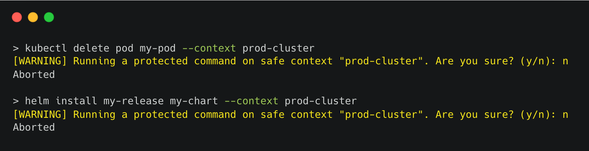

# Kubesafe

---

**Kubesafe** 🔁 Tired of accidentally running dangerous commands on the wrong Kubernetes cluster? Meet kubesafe — your safety net for cluster management.

<p>
    <a href="https://github.com/Telemaco019/kubesafe/actions"></a>
</p>

---



**kubesafe** allows you to safely run commands acrosss multiple Kubernetes contexts.
By allowing you to mark specific contexts as "safe" and define a list of protected commands, kubesafe makes sure
you never accidentally run a dangerous command on the wrong cluster.

Key Features:

- **🚀 Works with any Kubernetes tool**: kubesafe can wraps any CLI that targets a Kubernetes cluster. Whether you're using kubectl, helm, or any other tool, kubesafe has you covered.
- **🛡️ Context Protection with Custom Commands**: Mark one or more contexts as "safe" and define a list of commands that require confirmation before execution.
- **🔄 Flexible and Customizable**: Easily configure protected contexts and commands to suit your workflow.

## How does it work?

Simply prepend `kubesafe` to any command you want to run:

```shell
# Example with kubectl
kubesafe kubectl delete pod my-pod

# Example with Helm
kubesafe helm upgrade my-release stable/my-chart
```

Kubesafe seamlessly wraps any CLI command you provide as the first argument (e.g., kubectl, helm, kubecolor, etc.).
If you attempt to run a protected command in a safe context, kubesafe will prompt you for confirmation before proceeding.

For convenience, you can set aliases in your shell configuration:

```shell
alias kubectl='kubesafe kubectl'
alias helm='kubesafe helm'
```

Now, every time you use kubectl or helm, kubesafe will automatically protect your commands!

To manage your safe contexts and protected commands, see the [Managing contexts](#managing-contexts) section.

## Installation

### Install with Homebrew (Mac/Linux)

```sh
$ brew tap Telemaco019/kubesafe
$ brew install kubesafe
```

### Install with Go

```sh
$ go install github.com/telemaco019/kubesafe/kubesafe@latest
```

## Managing contexts

Kubesafe makes it easy to manage your safe contexts and protected commands. To see all available options, run:

```shell
kubesafe --help
```

### Adding a safe context

To add a safe context, simply execute:

```shell
kubesafe context add
```

Kubesafe will guide you interactively to select a context to mark as "safe" and choose the commands you want to protect.
Alternatively, you can add a safe context directly by specifying its name:

```shell
kubesafe context add my-context
```

The provided value can also be a regular expression to match multiple contexts:

```shell
kubesafe context add "prod-.*"
```

This will mark all context starting with `prod-` as safe.

### Defining custom protected commands

By default, kubesafe allows you to interactively choose commands to protect from a predefined list.
However, if you prefer to specify your own custom commands, you can provide them as a comma-separated list like this:

```shell
kubesafe context add my-context --commands "delete,apply,upgdrade"
```

### Listing safe contexts

To display all your configured safe contexts and their protected commands, use:

```shell
kubesafe context list
```

### Removing a safe context

To remove a context from your list of safe contexts, run:

```shell
kubesafe context remove my-context
```

## Similar tools

Kubesafe draws inspiration from existing kubectl plugins that offer similar features but are restricted to working exclusively with kubectl:

- [kubectl-prompt](https://github.com/jordanwilson230/kubectl-plugins/tree/krew?tab=readme-ov-file#kubectl-prompt): A kubectl plugin that displays a warning prompt when issuing commands in a flagged cluster or namespace
- [kubectl-safe](https://github.com/rumstead/kubectl-safe): A kubectl plugin to prevent shooting yourself in the foot with edit commands.

## License

This project is licensed under the Apache License. See the [LICENSE](./LICENSE) file for details.
